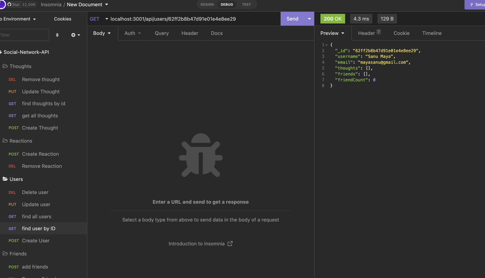
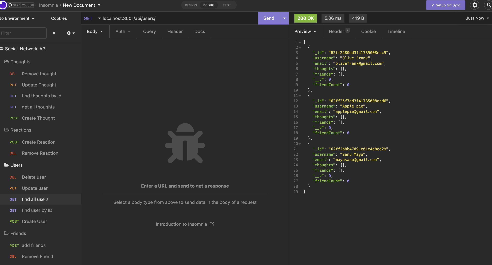
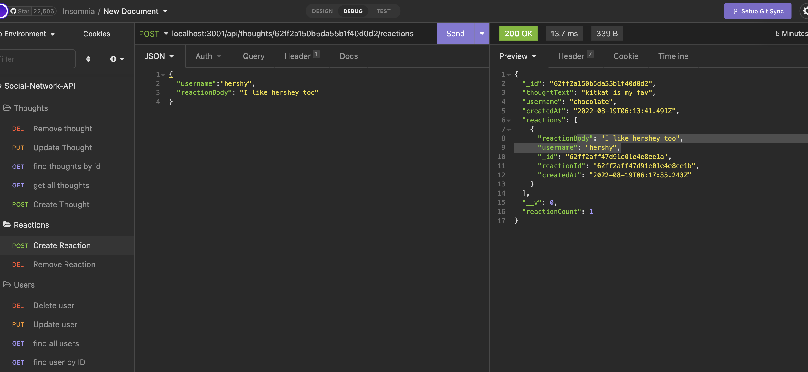

# Social-Network-API-nosql

Using MongoDB, and Express, I've created a social network web application where users can share their thoughts, and react to friend's thoughts, as well as create a friend list. I used Express.js for routing, a MongoDB database, and the Mongoose ODM. 


# Technologies
- Express
- MongoDB
- JavaScript
- Mongoose ODM

# Github Link and Demo Video link

- https://github.com/priyarizal/social-network-API-nosql

- https://drive.google.com/file/d/1jqvYPSjXbOFxaxmix0ou6jFpCU2DJMOv/view


# Significant Code Snippets
get route to get all thoughts and single thought
``` 
 getThoughts(req, res) {
        Thought.find()
            .then((users) => res.json(users))
            .catch((err) => res.status(500).json(err));
    },
    //gets single thought
    getSingleThought(req, res) {
        Thought.findOne({ _id: req.params.thoughtId })
            .then((thought) =>
                !thought
                    ? res.status(404).json({ message: 'Could not find thought with this ID!' })
                    : res.json(thought)
            )
            .catch((err) => res.status(500).json(err));
    },

```

delete route to remove a thought 

```
deleteThought(req, res) {
        Thought.findOneAndRemove(
            { _id: req.params.thoughtId },
        )
            .then((thought) =>
                !thought
                    ? res.status(404).json({ message: 'No comment found with the ID' })
                    : User.findOneAndUpdate(
                        { thoughts: req.params.thoughtId },
                        { $pull: { thoughts: req.params.thoughtId } },
                        { new: true }
                    )
            )
            .then((user) =>
                !user
                    ? res.status(404).json({ message: 'Your comment was created, but we could not find a user with this ID!' })
                    : res.json({ message: 'comment was successfully deleted' })
            )
            .catch((err) => res.status(500).json(err));
    },

```

# Screen Shots for overall Design Highlight






# Contributors

- Priya Rizal 

# License

- MIT

